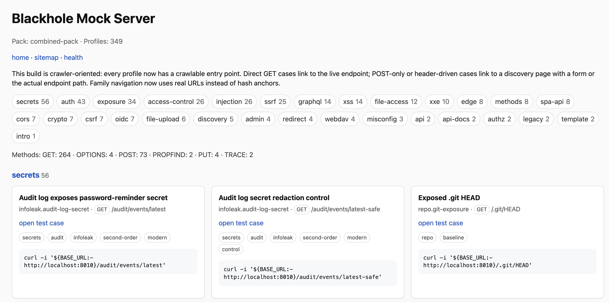

# Blackhole mock server with truth

> A black-box scanner sends its prayers into the dark.  
> Blackhole answers with pages, headers, flows, lies, half-truths, and—when needed—the unpleasant courtesy of ground truth.


Blackhole is a Python ASGI mock server for **black-box scanner testing, education, and reproducible benchmarking**. It serves vulnerable-looking behavior from replay profiles and explicit stateful mini-flows, while exposing a **truth/scoring API** to compare scanner findings against expected cases.

In other words: a scanner can hallucinate, overfit, panic, or boast. Blackhole keeps the receipts.

And every white hat should remember: all requests eventually fall into the black hole.




## General idea

Most scanner demos are too clean, too shallow, or too theatrical. Real targets are noisy. Controls matter. False positives matter. Second-order flows matter. “Looks vulnerable” is not the same as “is vulnerable.”

Blackhole exists to make that difference explicit.

It gives you:

- **replayable vulnerable-looking behavior** for black-box testing
- **safe/control branches** so you can measure false-positive suppression, not just noisy detection
- **stateful multi-step flows** for cases that do not fit in a single request
- **machine-readable ground truth** so results can be scored instead of argued about on vibes alone
- **a compact educational lab** for understanding how scanner logic behaves under realistic-but-controlled conditions

This is not a production honeypot. It is not a vulnerability zoo for chaos tourists. It is a **ground-truth harness** for people who want to test scanners, improve detection logic, compare builds, and teach others what signal and noise actually look like.

## Main use cases

### 1. Scanner testing

Use Blackhole as a deterministic target for:

- regression testing
- FP/FN analysis
- matcher tuning
- crawler and payload evaluation
- back-to-back comparison between scanner versions
- comparison against other tools or north-star baselines

### 2. Education

Use Blackhole to demonstrate:

- why banner-based detection is fragile
- why multi-step workflows matter
- why “error present” is not enough to prove exploitability
- why safe/control branches are necessary for realistic evaluation
- how scanner output should be compared to truth, not mythology

### 3. Ground-truth source for benchmarks

Blackhole exposes a **truth manifest** and scoring endpoints so it can serve as a benchmark substrate for:

- internal QA
- CI regression packs
- engineering acceptance tests
- research experiments
- demo environments where you want repeatability instead of folklore

## What is included

### Core engine

- replay DSL with matcher + response + truth fields
- request matcher for method/path/query/header/cookie/body/JSON field matching
- dynamic response renderer with Jinja2 templates
- tiny scenario state machine for multi-step flows
- truth/scoring endpoints
- admin API for health, profiles, logs, state, pack loading, reset, score
- compiler from normalized public corpus into runtime packs

### Starter and baseline content

- starter pack with reflected XSS, open redirect, permissive CORS, SQL error disclosure, GraphQL introspection, path traversal, secret exposure, stored XSS, and explicit second-order webhook/import/OAuth flows
- large baseline/legacy scanner pack
- safe/control variants for many cases so benchmarks can measure both detection and restraint

### Baseline / legacy coverage

- HTTP auth challenges: Basic, Digest, NTLM, Negotiate
- form login weak vs lockout control
- password recovery enumeration vs generic response control
- risky HTTP methods via OPTIONS
- TRACE enabled vs disabled control
- writable PUT vs denied control
- WebDAV writable vs read-only control
- backup files, swap files, archive exposure
- web.config, phpinfo, .git/HEAD, .svn/entries
- Tomcat manager and server-status style admin discovery
- crossdomain.xml and clientaccesspolicy.xml
- sensitive robots.txt entries and index-of directory listings

### Newer coverage

- DOM XSS and client-side HTML injection labs with safe controls
- authorization/object-state pack: sequential IDs, opaque share tokens, bulk export authz, second-order approval flow
- predictable token / brute-force pack: reset token, invite token, session id, OTP verify/resend with safe controls
- OIDC companion pack: discovery document, JWKS, request_uri flow, WebFinger enumeration

## Included pack counts

- starter profiles: 54
- compiled public corpus profiles: 171
- combined profiles: 225

## Quick start

```bash
python3.12 -m venv .venv
source .venv/bin/activate
pip install -r requirements.txt
python -m uvicorn blackhole.app.main:app --reload --port 8010
```

Production-leaning example:

```bash
python -m uvicorn blackhole.app.main:app   --host 0.0.0.0   --port 8010   --workers 2   --log-level info   --no-server-header
```

Then visit:

- `GET /__blackhole/health`
- `GET /__blackhole/profiles`
- `GET /__blackhole/truth-manifest.json`
- `GET /login`
- `GET /webdav/`
- `GET /auth/basic`
- `GET /crossdomain.xml`
- `TRACE /trace`
- `OPTIONS /api/methods`

## Command-line parameters

Blackhole is typically started through `uvicorn`, so the effective runtime switches are the `uvicorn` command-line options. Below is the full attached option list, preserved as the authoritative launch surface for the current README revision.

### Usage

```bash
python -m uvicorn [OPTIONS] APP
```

### Full option list

```text
Usage: python -m uvicorn [OPTIONS] APP

Options:
  --host TEXT                     Bind socket to this host.  [default:
                                  127.0.0.1]
  --port INTEGER                  Bind socket to this port. If 0, an available
                                  port will be picked.  [default: 8000]
  --uds TEXT                      Bind to a UNIX domain socket.
  --fd INTEGER                    Bind to socket from this file descriptor.
  --reload                        Enable auto-reload.
  --reload-dir PATH               Set reload directories explicitly, instead
                                  of using the current working directory.
  --reload-include TEXT           Set glob patterns to include while watching
                                  for files. Includes '*.py' by default; these
                                  defaults can be overridden with `--reload-
                                  exclude`. This option has no effect unless
                                  watchfiles is installed.
  --reload-exclude TEXT           Set glob patterns to exclude while watching
                                  for files. Includes '.*, .py[cod], .sw.*,
                                  ~*' by default; these defaults can be
                                  overridden with `--reload-include`. This
                                  option has no effect unless watchfiles is
                                  installed.
  --reload-delay FLOAT            Delay between previous and next check if
                                  application needs to be. Defaults to 0.25s.
                                  [default: 0.25]
  --workers INTEGER               Number of worker processes. Defaults to the
                                  $WEB_CONCURRENCY environment variable if
                                  available, or 1. Not valid with --reload.
  --loop [auto|asyncio|uvloop]    Event loop factory implementation.
                                  [default: auto]
  --http [auto|h11|httptools]     HTTP protocol implementation.  [default:
                                  auto]
  --ws [auto|websockets|websockets-sansio|wsproto]
                                  WebSocket protocol implementation.
                                  [default: auto]
  --ws-max-size INTEGER           WebSocket max size message in bytes
                                  [default: 16777216]
  --ws-max-queue INTEGER          The maximum length of the WebSocket message
                                  queue.  [default: 32]
  --ws-ping-interval FLOAT        WebSocket ping interval in seconds.
                                  [default: 20.0]
  --ws-ping-timeout FLOAT         WebSocket ping timeout in seconds.
                                  [default: 20.0]
  --ws-per-message-deflate BOOLEAN
                                  WebSocket per-message-deflate compression
                                  [default: True]
  --lifespan [auto|on|off]        Lifespan implementation.  [default: auto]
  --interface [auto|asgi3|asgi2|wsgi]
                                  Select ASGI3, ASGI2, or WSGI as the
                                  application interface.  [default: auto]
  --env-file PATH                 Environment configuration file.
  --log-config PATH               Logging configuration file. Supported
                                  formats: .ini, .json, .yaml.
  --log-level [critical|error|warning|info|debug|trace]
                                  Log level. [default: info]
  --access-log / --no-access-log  Enable/Disable access log.
  --use-colors / --no-use-colors  Enable/Disable colorized logging.
  --proxy-headers / --no-proxy-headers
                                  Enable/Disable X-Forwarded-Proto,
                                  X-Forwarded-For to populate url scheme and
                                  remote address info.
  --server-header / --no-server-header
                                  Enable/Disable default Server header.
  --date-header / --no-date-header
                                  Enable/Disable default Date header.
  --forwarded-allow-ips TEXT      Comma separated list of IP Addresses, IP
                                  Networks, or literals (e.g. UNIX Socket
                                  path) to trust with proxy headers. Defaults
                                  to the $FORWARDED_ALLOW_IPS environment
                                  variable if available, or '127.0.0.1'. The
                                  literal '*' means trust everything.
  --root-path TEXT                Set the ASGI 'root_path' for applications
                                  submounted below a given URL path.
  --limit-concurrency INTEGER     Maximum number of concurrent connections or
                                  tasks to allow, before issuing HTTP 503
                                  responses.
  --backlog INTEGER               Maximum number of connections to hold in
                                  backlog
  --limit-max-requests INTEGER    Maximum number of requests to service before
                                  terminating the process.
  --limit-max-requests-jitter INTEGER
                                  Maximum jitter to add to limit_max_requests.
                                  Staggers worker restarts to avoid all
                                  workers restarting simultaneously.
                                  [default: 0]
  --timeout-keep-alive INTEGER    Close Keep-Alive connections if no new data
                                  is received within this timeout (in
                                  seconds).  [default: 5]
  --timeout-graceful-shutdown INTEGER
                                  Maximum number of seconds to wait for
                                  graceful shutdown.
  --timeout-worker-healthcheck INTEGER
                                  Maximum number of seconds to wait for a
                                  worker to respond to a healthcheck.
                                  [default: 5]
  --ssl-keyfile TEXT              SSL key file
  --ssl-certfile TEXT             SSL certificate file
  --ssl-keyfile-password TEXT     SSL keyfile password
  --ssl-version INTEGER           SSL version to use (see stdlib ssl module's)
                                  [default: 17]
  --ssl-cert-reqs INTEGER         Whether client certificate is required (see
                                  stdlib ssl module's)  [default: 0]
  --ssl-ca-certs TEXT             CA certificates file
  --ssl-ciphers TEXT              Ciphers to use (see stdlib ssl module's)
                                  [default: TLSv1]
  --header TEXT                   Specify custom default HTTP response headers
                                  as a Name:Value pair
  --version                       Display the uvicorn version and exit.
  --app-dir TEXT                  Look for APP in the specified directory, by
                                  adding this to the PYTHONPATH. Defaults to
                                  the current working directory.  [default:
                                  ""]
  --h11-max-incomplete-event-size INTEGER
                                  For h11, the maximum number of bytes to
                                  buffer of an incomplete event.
  --factory                       Treat APP as an application factory, i.e. a
                                  () -> <ASGI app> callable.
  --help                          Show this message and exit.
```

### Practical launch examples

Development:

```bash
python -m uvicorn blackhole.app.main:app --reload --port 8010
```

Listen on all interfaces:

```bash
python -m uvicorn blackhole.app.main:app --host 0.0.0.0 --port 8010
```

Two workers, quieter headers:

```bash
python -m uvicorn blackhole.app.main:app --workers 2 --no-server-header --log-level info
```

TLS termination inside uvicorn:

```bash
python -m uvicorn blackhole.app.main:app   --host 0.0.0.0   --port 8443   --ssl-certfile ./certs/server.crt   --ssl-keyfile ./certs/server.key
```

## How to use it

### As a test target

1. Start Blackhole locally or in CI.
2. Run your scanner against it.
3. Collect findings.
4. Compare findings against the truth manifest or scoring API.
5. Investigate:
   - what was found correctly
   - what was missed
   - what should not have fired
   - which flows required state, sequencing, or better matcher logic

### As an educational lab

Use individual packs and endpoints to show students or engineers:

- what the scanner sees
- what the server actually knows
- where naive signatures fail
- how controls differ from vulnerable cases
- why ground truth is the only adult in the room

### As a benchmark substrate

Blackhole is especially useful when you need a **repeatable source of truth** for:

- regression gates in CI
- nightly scanner comparison
- tuning new detection families
- validating reductions in false positives
- evaluating crawler, payload, or post-processing changes

## Truth model

Blackhole does not merely emit behavior. It also tells you what that behavior means.

The project exposes **machine-readable truth hints** through the truth manifest and related scoring/admin endpoints. That allows you to treat the target as a **ground-truth source**, not just a theatrical web app with suspicious pages.

This matters because many benchmark targets answer only one question: *can a demo payload trigger something interesting?*  
Blackhole tries to answer the more useful ones:

- Was the case actually present?
- Was it only present under specific conditions?
- Was there a safe/control branch?
- Was the issue first-order or second-order?
- Did the scanner detect signal, or merely react to noise?

## Notes

- Safe/control branches are included for many baseline cases so the benchmark can measure false-positive suppression as well as detection.
- Custom built-in flows expose machine-readable truth hints via the truth manifest and discovery pages.
- This project is useful for **tests, education, and ground-truth-driven evaluation**.
- If your scanner sees ghosts, Blackhole will not argue. It will score them.

## Philosophy

Security testing is full of heroic certainty built on flimsy evidence.

A scanner sees one stack trace and declares victory.  
A benchmark shows one toy login form and calls itself realism.  
A dashboard paints everything red and hopes nobody asks “compared to what?”

Blackhole is built for that uncomfortable follow-up question.

It is a small artificial world where appearances can deceive, controls can look tempting, and truth is still available if you are disciplined enough to ask for it.

Because that is the whole joke of black-box testing: you stare into the dark, send requests into the void, and hope meaning comes back. Sometimes it does. Sometimes it is only your own reflection, gravitationally bent.

## Author

**Sergey Gordeycik**  
serg.gordey@gmail.com  
https://scadastrangelove.blogspot.com/

## Copyright

**(c) Sergey Gordeycik**

## License

This project uses a deliberately non-commercial licensing model.

### Code

Unless stated otherwise, the **source code** is offered under the **PolyForm Noncommercial License 1.0.0**.

That means, in plain human language:

- you may use, study, modify, and share the code for **non-commercial purposes**
- you may use it for **research, testing, education, internal lab work, and benchmarking**
- you may **not** use it as part of a commercial product, paid service, customer-facing platform, or revenue-generating workflow without separate permission from the author

### Documentation, benchmark packs, examples, and media

Unless stated otherwise, the **documentation, benchmark descriptions, examples, README content, and media/artwork** are offered under **Creative Commons Attribution-NonCommercial 4.0 International (CC BY-NC 4.0)**.

That means you may copy, adapt, and redistribute those materials for **non-commercial use** with attribution.

### Commercial use

For commercial licensing, OEM-style usage, customer delivery, hosted benchmark services, product embedding, or paid consulting bundles that include Blackhole, contact:

**Sergey Gordeycik**  
serg.gordey@gmail.com

### Why this model

Blackhole is meant to help research, testing, learning, and engineering truth. It is not meant to be quietly swallowed by a polished commercial wrapper and resold as revelation.

Or, in a voice more fitting the project: the benchmark is free for those who seek signal; the bill arrives when somebody tries to monetize the singularity.
